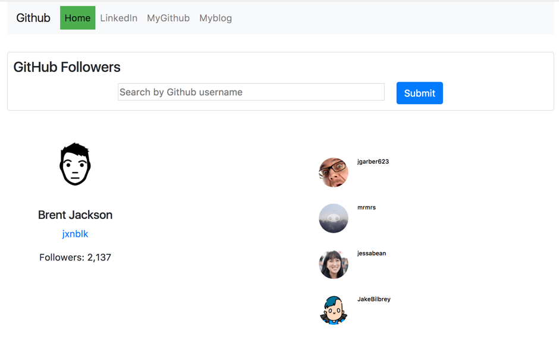

# **GitHub Followers challenge**

This project lets user to search for a GitHub user follower’s with their username.
This is developed using the React JS.

## Details:
- Display the user's GitHub profile, follower count, and a list of the user's follower avatars and their names
- If the user has many followers, return a portion and create a "load more" button
- The button should persist until there are no more followers to fetch
- Nav bar shows my LinkedIn , Github and profile Myportfolio developed during masters

## Tools :
- Boostrap – Used to design the front end and Responsive across devices
- React js – To implement the API
- CSS – To add custom styles
- Node – To run at server
- Heroku App- To Host the API live
#### **Live Site:**
https://githubfollowers-reactapi.herokuapp.com

